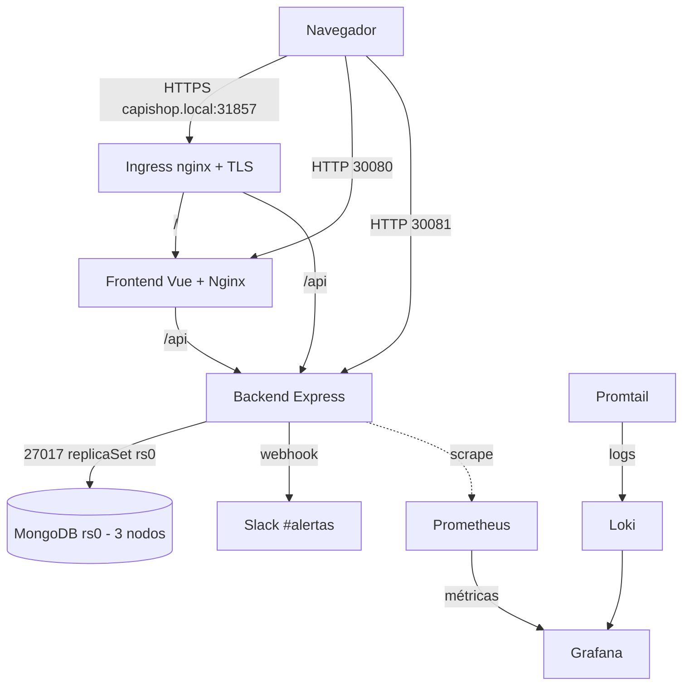

# CapiShop — Mascotas y Accesorios

CapiShop es una tienda en línea de mascotas y accesorios. La hice como proyecto
final de DevOps y la idea era no quedarme solo en la app, sino llevarla hasta un
despliegue completo en Kubernetes con todo lo que eso implica: contenedores,
base de datos replicada, red segura, monitoreo, logs, CI/CD y despliegue canary.

La aplicación tiene dos partes: un backend en Node.js con Express que expone una
API REST y guarda todo en MongoDB, y un frontend en Vue 3 que consume esa API.
Las dos corren en contenedores dentro de un cluster de tres nodos.

Este README es el punto de entrada del proyecto. Aquí está la vista general. Para
el detalle de la aplicación revisa [app/README.md](app/README.md) y para el
despliegue completo en Kubernetes revisa [k8s/README.md](k8s/README.md).

## Requisitos cubiertos

El proyecto cubre ocho requisitos. Los numeré R1 a R8 y cada uno se apoya en
archivos reales del repositorio.

- R1 — Contenerización: backend y frontend tienen su `Dockerfile`. El del
  frontend usa build multietapa con Node 20 y Nginx. Las imágenes se publican en
  Docker Hub como `isabelkitty/capishop-backend` y `isabelkitty/capishop-frontend`.
- R2 — Orquestación en Kubernetes: Deployments del backend y frontend con 2
  réplicas cada uno, Services NodePort, probes de liveness y readiness y límites
  de recursos. Definidos en `k8s/app/backend.yaml` y `k8s/app/frontend.yaml`.
- R3 — Almacenamiento persistente: StorageClass `nfs-csi` por defecto con el
  provisioner `nfs.csi.k8s.io`. MongoDB usa volúmenes dinámicos por cada réplica.
  Definido en `k8s/storage/storageclass-nfs.yaml`.
- R4 — Base de datos replicada: MongoDB como StatefulSet con replica set `rs0` de
  tres nodos (`mongodb-0`, `mongodb-1`, `mongodb-2`). Definido en
  `k8s/app/mongodb.yaml`.
- R5 — Red segura: NetworkPolicies que arrancan en default-deny y van abriendo
  solo lo necesario (frontend a backend, backend a Mongo, DNS, ingress). Están en
  `k8s/network/01` a `08`.
- R6 — Ingress con TLS: Ingress nginx para el host `capishop.local` con
  certificado emitido por cert-manager. Definido en `k8s/ingress/`.
- R7 — Observabilidad: Prometheus, Grafana, node-exporter y kube-state-metrics
  para métricas, más Loki y Promtail para logs. Definidos en `k8s/monitoring/` y
  `k8s/logging/`.
- R8 — CI/CD y entrega progresiva: Tekton construye y publica las imágenes,
  ArgoCD sincroniza el cluster con el repo y Argo Rollouts hace el despliegue
  canary del backend. Definidos en `k8s/cicd/` y `k8s/canary/`.

> Nota: los archivos del repositorio no traen un documento de rúbrica con los
> nombres R1 a R8, así que numeré los requisitos a partir de los componentes que
> sí están implementados y verificados. Lo dejo claro para no dar a entender que
> esa numeración viene de un archivo del proyecto.

## Diferenciadores

Estos son los puntos que hacen el proyecto más completo y que se pueden
demostrar en vivo.

- Ingress con TLS real sobre el host `capishop.local`, con certificado de
  cert-manager y el candado del navegador.
- NetworkPolicies demostrables: un pod intruso no logra llegar a MongoDB.
- MongoDB en replica set `rs0` de tres nodos, con elección de primario y datos
  que sobreviven al borrado de un pod.
- Canary Release del backend con Argo Rollouts en pasos de 10%, 50% y 100%.
- Alerta de stock bajo a Slack disparada desde `checkout.js` cuando una compra
  deja el stock de un producto en 5 o menos.

## Arquitectura general



El navegador entra al frontend, el frontend llama a la API del backend, y el
backend lee y escribe en MongoDB. En paralelo, Promtail recoge los logs de los
pods y los manda a Loki, mientras Prometheus saca métricas de los nodos y del
cluster. Grafana junta métricas y logs en un solo panel.

## Estructura del repositorio

```
capishop-k8s/
├── README.md              Este archivo (vista general)
├── app/                   Código de la aplicación
│   ├── README.md          Detalle de backend y frontend
│   ├── backend/           API REST en Node.js + Express
│   └── frontend/          SPA en Vue 3 + Vite
└── k8s/                   Manifiestos de Kubernetes
    ├── README.md          Guía de despliegue paso a paso
    ├── ansible/           Instalación del cluster
    ├── app/               Namespace, backend, frontend, mongodb, seed
    ├── mongodb/           Variante de MongoDB con auth (ver nota en k8s/README)
    ├── storage/           StorageClass NFS
    ├── quota/             ResourceQuotas
    ├── network/           NetworkPolicies 01 a 08
    ├── ingress/           ClusterIssuer e Ingress TLS
    ├── monitoring/        Prometheus, Grafana, exporters
    ├── logging/           Loki y Promtail
    ├── cicd/              Tekton y ArgoCD
    └── canary/            Argo Rollouts
```

## Tecnologías por categoría

- Aplicación: Node.js 18 (backend), Vue 3 con Vite (frontend), Express,
  Mongoose, axios.
- Base de datos: MongoDB en replica set rs0.
- Contenedores: Docker, imágenes publicadas en Docker Hub, build con Kaniko en
  el pipeline.
- Orquestación: Kubernetes v1.28.15 sobre containerd, instalado con Ansible.
- Almacenamiento: NFS con el CSI driver `nfs.csi.k8s.io`.
- Red: Canal como CNI y NetworkPolicies nativas de Kubernetes.
- Ingress y TLS: ingress-nginx y cert-manager.
- Monitoreo: Prometheus, Grafana, node-exporter, kube-state-metrics.
- Logs: Loki y Promtail.
- CI/CD: Tekton Pipelines y ArgoCD.
- Entrega progresiva: Argo Rollouts.
- Alertas: webhook de Slack al canal #alertas.

## Entorno de pruebas

El cluster son tres VMs con Rocky Linux 9.7 y Kubernetes v1.28.15.

| Nodo               | IP                | Rol     |
|--------------------|-------------------|---------|
| capishop-master01  | 192.168.224.135   | master  |
| capishop-worker01  | 192.168.224.136   | worker  |
| capishop-worker02  | 192.168.224.137   | worker  |

Accesos del proyecto:

| Servicio              | URL                                  | Credenciales        |
|-----------------------|--------------------------------------|---------------------|
| Frontend (NodePort)   | http://192.168.224.135:30080         | —                   |
| Backend API (NodePort)| http://192.168.224.135:30081         | —                   |
| App con Ingress TLS   | https://capishop.local:31857         | —                   |
| Prometheus            | http://192.168.224.135:30900         | —                   |
| Grafana               | http://192.168.224.135:30300         | admin / admin123    |
| ArgoCD                | https://192.168.224.135:32214        | admin / zbLuMbtQvLLxaLE1 |

Para que `capishop.local` resuelva, hay que agregarlo al archivo hosts de la
máquina desde donde se entra, apuntando a 192.168.224.135.

## Cómo empezar

El orden recomendado para entender o levantar el proyecto es:

1. Lee la app en [app/README.md](app/README.md): qué hace el backend, qué
   endpoints expone y cómo se conecta el frontend.
2. Sigue el despliegue en [k8s/README.md](k8s/README.md): desde el cluster con
   Ansible hasta el canary release, paso por paso.

## Comandos rápidos de verificación general

Ver que los tres nodos estén listos. Se esperan los tres en estado Ready.

```bash
kubectl get nodes -o wide
```

Ver los pods de la aplicación. Se espera el backend y el frontend con 2 réplicas
cada uno y MongoDB con 3.

```bash
kubectl get pods -n capishop
```

Ver los Services de la app con sus NodePorts. Se espera ver 30080 y 30081.

```bash
kubectl get svc -n capishop
```

Probar el health del backend directo por su NodePort. Debe responder un JSON con
status ok.

```bash
curl http://192.168.224.135:30081/health
```

Probar que la API ya tiene productos cargados. Debe regresar la lista en JSON.

```bash
curl http://192.168.224.135:30081/api/productos
```

## Autora

Ana Isabel Díaz Bautista
